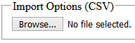
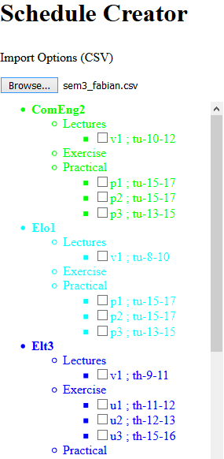

# Schedule-Creator
Making (HSR) schedule creation easier for students

## Import a schedule options file
1. 
2. wait until the file is loaded

## Create a schedule
Use the checkboxes on the left to select/unselect events



## Create a schedule options file
The [CSV](https://en.wikipedia.org/wiki/Comma-separated_values) format is used.
You can either use a text-editor or a spreadsheet program (e.g. Microsoft Excel) to edit the file.

* each line represents a module
* structure:

```<NAME>, <COLOR>, lecture, [<mo|tu|we|th|fr>, <0-23>, <0-23>, ...], exercise, [<mo|tu|we|th|fr>, <0-23>, <0-23>, ...], practical, [<mo|tu|we|th|fr>, <0-23>, <0-23>, ...],```

* if an event is not continuous and by that has multiple occurrences, use the `+` operator. E.g.:

```MyModule, green, lecture, mo, 8, 10, +, we, 13, 14```

### Complete example
```
ComEng2,lime,lecture,tu,10,12,practical,tu,15,17,tu,15,17,tu,13,15
Elo1,cyan,lecture,tu,8,10,practical,tu,15,17,tu,15,17,tu,13,15
Elt3,blue,lecture,th,9,11,exercise,th,11,12,th,12,13,th,15,16
IntTra,salmon,lecture,we,10,12,+,th,13,15,we,13,15,+,th,13,15
NaT1, hotpink,lecture,mo,10,12,practical,mo,14,16,mo,14,16,mo,16,18
Ph3,green,lecture,we,15,17,+,fr,8,9,we,14,15,+,fr,10,12,we,10,12,+,th,13,14,exercise,fr,9,10,fr,15,16,fr,13,14,fr,14,15,th,10,11,th,9,10,th,14,15,th,14,15
PMswEng,brown,lecture,mo,12,13,practical,mo,16,18,fr,13,15,mo,14,16
RegT1,gray,lecture,fr,10,12,practical,we,10,12,we,10,12,we,13,15
SigSys1,olive,lecture,we,8,10,practical,we,10,12,we,10,12,fr,13,15
WrStat,gold,lecture,tu,13,15,+,fr,15,16,tu,15,17,+,fr,9,10,exercise,fr,16,17,mo,16,17,fr,12,13,fr,11,12
WS_DST,crimson,lecture,mo,8,10,practical,mo,14,16,mo,14,16,mo,16,18
```
