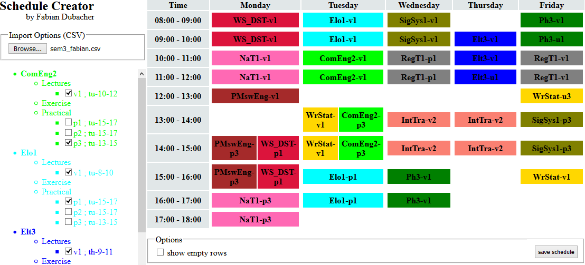
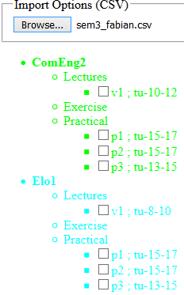

# About project
### Quality: **OK**
### Year of creation: 2020

## Scale of quality
**professional**
maintainable, scalable and performing -> well thought out architecture, clean structure, complete documentation

**prototyping**
maintainable and scalable to a certain extent -> rough architecture, clean structure, readable

**OK**
maintainable -> clean structure, readable

**hacky**
just good enough to run

# Schedule-Creator
Making (HSR) schedule creation easier for students



## Getting started
1. download project under 'release'
2. unzip
3. open 'schedule-creator.html' with a browser
4. import a schedule options CSV file (e.g. 'semester3.csv')

**Please note:**
This web app was only tested with Firefox and does not support small screens like smartphones.
For the best experience use it on a desktop-computer or laptop in a maximized browser window.

## Import a schedule options file
1. 
2. wait until the file is loaded

## Create schedule
Use the checkboxes on the left to select/unselect events



### Save schedule
Save your schedule for later use


## Create schedule options file
The [CSV](https://en.wikipedia.org/wiki/Comma-separated_values) format is used.
You can either use a text-editor or a spreadsheet program (e.g. Microsoft Excel) to edit the file.

### Basic structure
each line represents a module

```<NAME>, <COLOR>, lecture, [(<mo|tu|we|th|fr>, <0-23>, <0-23>, <0|1>), (...)], exercise, [(<mo|tu|we|th|fr>, <0-23>, <0-23>, <0|1>), (...)], practical, [(<mo|tu|we|th|fr>, <0-23>, <0-23>, <0|1>), (...)]```

* `<NAME>` name of the course
* `<COLOR>` color to use in the schedule
* `<mo|tu|we|th|fr>` day an event of the course happens
* `<0-23>` start/end date
* `<0|1>` show/hide in schedule

### Non-continous events
If an event is not continuous and by that has multiple occurrences, use the `+` operator. E.g.:

```MyModule, green, lecture, mo, 8, 10, +, we, 13, 14```

### Complete example
```
ComEng2,lime,lecture,tu,10,12,0,practical,tu,15,17,0,tu,15,17,0,tu,13,15,0
Elo1,cyan,lecture,tu,8,10,0,practical,tu,15,17,0,tu,15,17,0,tu,13,15,0
Elt3,blue,lecture,th,9,11,0,exercise,th,11,12,0,th,12,13,0,th,15,16,0
IntTra,salmon,lecture,we,10,12,0,+,th,13,15,0,we,13,15,0,+,th,13,15,0
NaT1, hotpink,lecture,mo,10,12,0,practical,mo,14,16,0,mo,14,16,0,mo,16,18,0
Ph3,green,lecture,we,15,17,0,+,fr,8,9,0,we,14,15,0,+,fr,10,12,0,we,10,12,0,+,th,13,14,0,exercise,fr,9,10,0,fr,15,16,0,fr,13,14,0,fr,14,15,0,th,10,11,0,th,9,10,0,th,14,15,0,th,14,15,0
PMswEng,brown,lecture,mo,12,13,0,practical,mo,16,18,0,fr,13,15,0,mo,14,16,0
RegT1,gray,lecture,fr,10,12,0,practical,we,10,12,0,we,10,12,0,we,13,15,0
SigSys1,olive,lecture,we,8,10,0,practical,we,10,12,0,we,10,12,0,fr,13,15,0
WrStat,gold,lecture,tu,13,15,0,+,fr,15,16,0,tu,15,17,0,+,fr,9,10,0,exercise,fr,16,17,0,mo,16,17,0,fr,12,13,0,fr,11,12,0
WS_DST,crimson,lecture,mo,8,10,0,practical,mo,14,16,0,mo,14,16,0,mo,16,18,0
```
